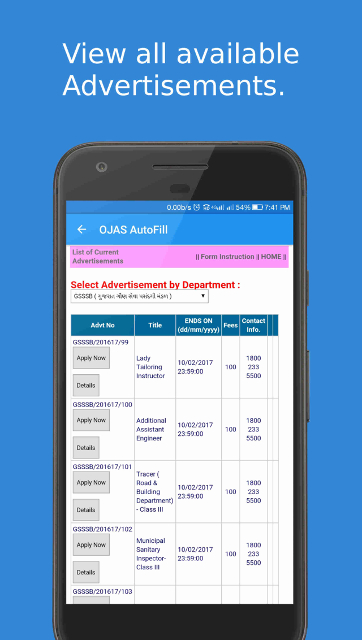

## OJAS AutoFill: Automatic Form Filling for Gujarat Government Jobs Application Website
### An Android app for automatic form filling for Gujarat Government Jobs Application website. It saves time by auto-filling most details in the form and remembers last five job advertisement numbers.

##### :star: Play Store Downloads: 7000+

##### :star: Play Store Rating: 4.7 (147 Ratings)
 
* Play Store URL: https://play.google.com/store/apps/details?id=in.aternal.ojasautofill
* Technologies: Java, JavaScript, XML, Sharedpreferences
* Tools and OS: Android Studio, Firebase, Admob, Ubuntu
* Platform: Android 4.0+
* Modules: MyDetails, WebViewModifier, JavaScriptCode
* Lines of Code: 26121

### Screenshots

